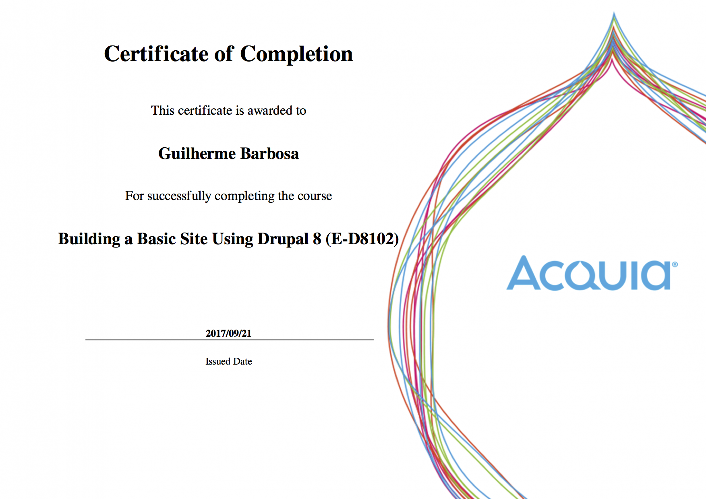

# My Certifications
In this repository I will share some of my certificates that I have got from courses, events, and so on.

###  **September 2017**

#### - Acquia Academy, Drupal 8 Module Development (E-D8203)

This course assumes you're an experienced site builder with Drupal 8. You know how to configure a Drupal site, but you've found limitations with what you can do with core and contributed modules. You do have experience with programming. While you don't need to be an expert in PHP, you understand the basic constructs of programming enough to work with a new language.

Language: EN-US

Applier: [Acquia](https://customers.acquiacademy.com)

#### - Acquia Academy, Drupal 8 Layout and Theming (E-D8202)

This course provides a variety of approaches for making dynamic layouts in Drupal, and helps users to choose the right approach for their site.

Language: EN-US

Applier: [Acquia](https://customers.acquiacademy.com)

#### - Acquia Academy, Building Websites with Drupal 8 (E-D8201)

Building Websites with Drupal 8 provides a comprehensive introduction to the essential skills necessary when building websites with Drupal.

Language: EN-US

Applier: [Acquia](https://customers.acquiacademy.com)

#### - Acquia Academy, Extending and Managing a Drupal 8 Site (E-D8103)

To further your Drupal 8 expertise, you will learn strategies for finding and evaluating modules, leveraging the Drupal Community, and powerful modules such as Forum and Book.

Language: EN-US

Applier: [Acquia](https://customers.acquiacademy.com)

#### - Acquia Academy, Building a Basic Site Using Drupal 8 (E-D8102)

You know the concepts and skills to establish yourself as proficient in Drupal 8.

Language: EN-US

Applier: [Acquia](https://customers.acquiacademy.com)

#### - Acquia Academy, Introduction to Drupal 8 (E-D8101)

You know how to leverage Drupal 8 to build amazing websites.

Language: EN-US

Applier: [Acquia](https://customers.acquiacademy.com)

###  **May 2018**

#### - Docker: Ferramenta essencial para Desenvolvedores (UC-6UEO7JEF)

Learn to create professional environments with Docker, the leading container technology on the market!

Language: PT-BR

Applier: [COD3R Cursos Online](https://www.cod3r.com.br)
